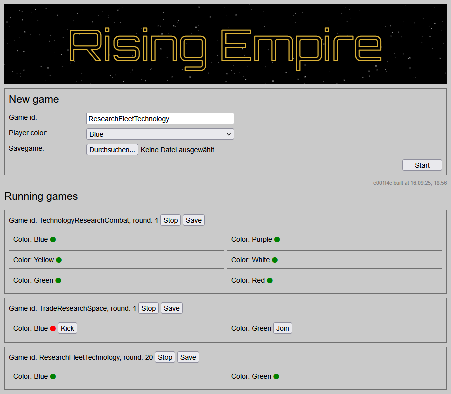
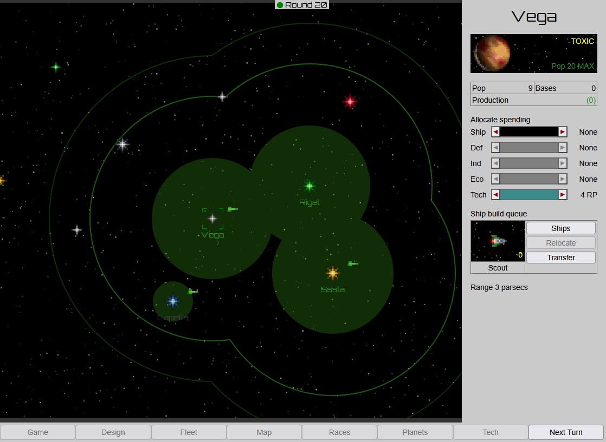

# Rising Empire

Browser-based turn-based strategy game.
It is a homage to the original Master of Orion from 1993.

You can give it a try at https://risingempire.de.
A moo-theme.zip (you need a copy of Master of Orion) can be generated by running `java -jar rising-empire-moo-theme-2.0.0.jar /path/to/orion`.
The JAR file `rising-empire-moo-theme-2.0.0.jar` is available in the 2.0.0 release.
At least Java 22 is needed for running it.

Design goals:

- fast-paced gameplay
- macro-management focus
- appearance similar to Master of Orion

## Screenshots





## Prerequisites for building

1. at least JDK 22
1. recent Maven (tested with 3.9.9)
1. requires `mvn clean install` of [javascript-es2020-parser 0.5.1](https://github.com/janScheible/javascript-es2020-parser/tree/0.5.1)
1. `mvn clean install` of [Pocketsaw 1.7.1](https://github.com/janScheible/pocketsaw/tree/1.7.1)
1. `mvn clean install` of [esbuild-java-spring-boot 0.1.4](https://github.com/janScheible/esbuild-java-spring-boot/tree/esbuild-devserver-spring-boot-starter-v0.1.4)
1. **[optionally]** [maven-skip-execution-profile-extension](https://github.com/janScheible/spring-boot-netbeans-getting-started/tree/master/skip-execution-profile/maven-skip-execution-profile-extension) for a smooth Netbeans experience

## Prerequisites for developing

1. Visual Studio Code for the frontend
1. Java IDE for the Spring Boot backend and game logic

## Architecture

Web Components frontend with Hypermedia backend.

## Commit message format

All messages must adhere to the following format:

```markdown
summary (use same summary to group multiple commits)

- change details as unordered Markdown list
  - with multiple levels to group things
- single backticks for `code`
```

The blank line between summary and details is mandatory.
Only Markdown syntax for unordered lists and code is allowed.
Lower case is in general preferred, only proper names should be capitalized.

## Third-party

Although third-party libraries should be avoided, in some cases it makes sense to use a specific library. It is important that these are only individual (potentially interchangeable) libraries and not frameworks that dominate the entire code base.

### Libraries

1. [fflate](https://github.com/101arrowz/fflate) ([MIT License](https://opensource.org/license/MIT/))
1. [IDB-Keyval](https://github.com/jakearchibald/idb-keyval) ([Apache License 2.0](https://opensource.org/license/apache-2-0/))
1. [Sockette](https://github.com/lukeed/sockette) ([MIT License](https://opensource.org/license/MIT/))
1. [SmoothScroll.js](https://github.com/LieutenantPeacock/SmoothScroll) ([MIT License](https://opensource.org/license/MIT/))

### Assets

1.  [Orbitron font](https://www.1001fonts.com/orbitron-font.html) ([SIL Open Font License](http://scripts.sil.org/OFL))
1.  [Lucid Dream music by Ronald Kah](https://ronaldkah.de/) ([Creative Commons Namensnennung 4.0 International License](https://creativecommons.org/licenses/by/4.0/deed.de))
